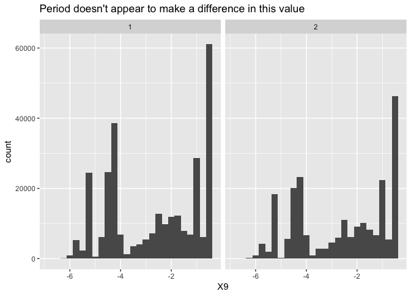
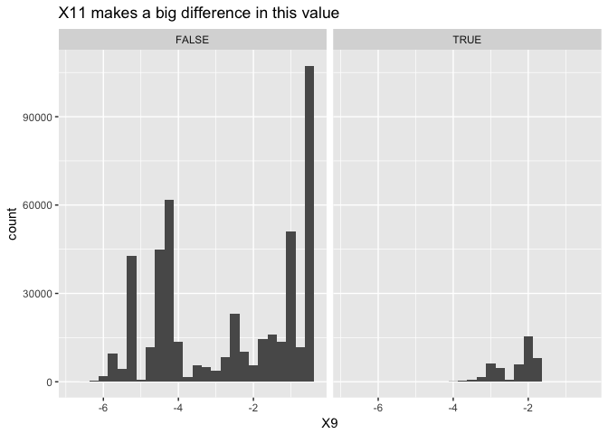
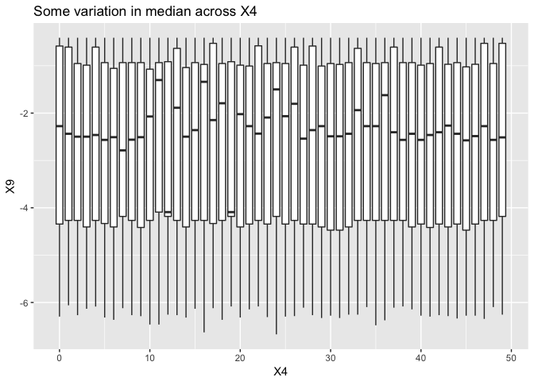
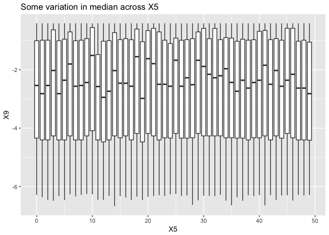
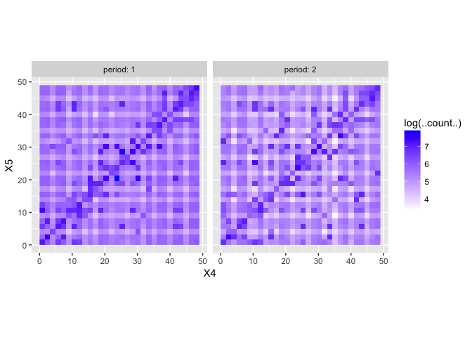
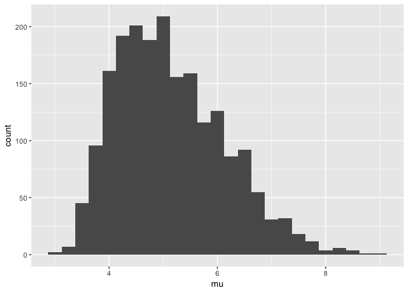
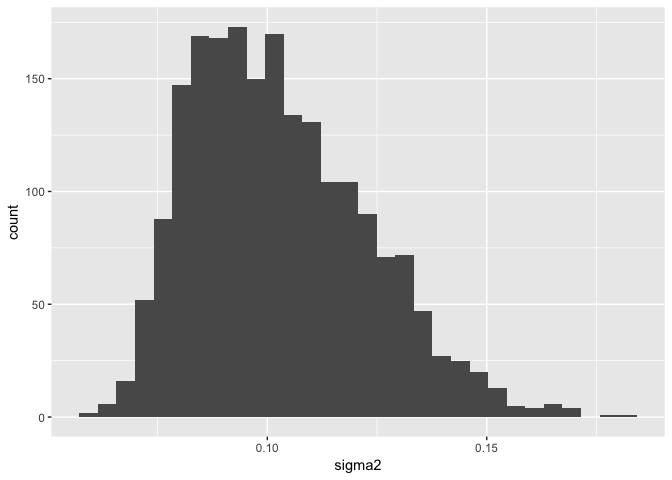
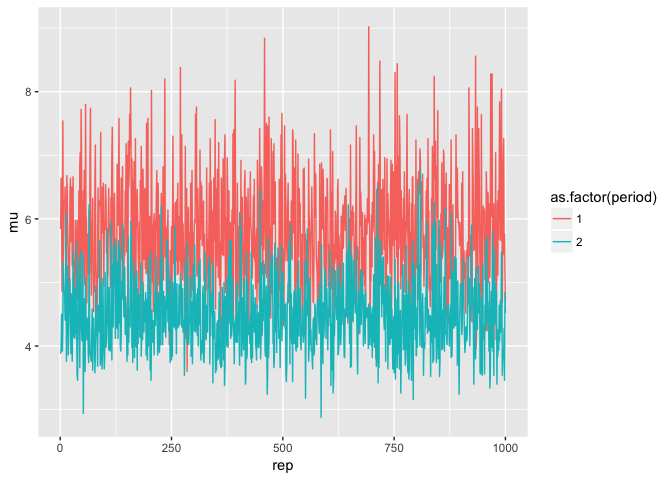
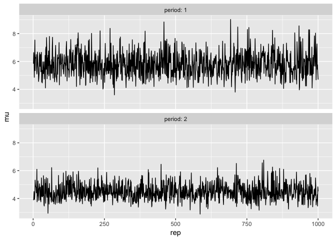

Attempting to pull iterations out of RSiena
================
Sam Tyner
1/23/2017

First I set up some simple examples from the `RSiena` website.

``` r
library(RSiena)
# ---- A. ----------------------------------------------------------------------
# First we have to create objects for the dependent variables.

# sienaDependent creates a sienaDependent object, here a network,
# from a matrix or array or list of sparse matrix of triples.
# The name of this network object (here: friendship) will be used
# in the output file.
 setwd("data/s50_data")
  friend.data.w1 <- as.matrix(read.table("s50-network1.dat"))
  friend.data.w2 <- as.matrix(read.table("s50-network2.dat"))
  friend.data.w3 <- as.matrix(read.table("s50-network3.dat"))
  drink <- as.matrix(read.table("s50-alcohol.dat"))
  smoke <- as.matrix(read.table("s50-smoke.dat"))

 friendship <- sienaDependent(
                     array( c( friend.data.w1, friend.data.w2, friend.data.w3 ),
                     dim = c( 50, 50, 3 ) ) )

# The integers in the dim() here refer to the number of nodes (senders,
# receivers) and the number of waves.
# This object is an array of dimension 50 x 50 x 3, representing
# three adjacency matrices, with a number of attributes.
# Note that this is an object of class

        class(friendship)
```

    ## [1] "sienaDependent"

``` r
# with specific attributes and methods associated with it.
# You can get the detailed information by requesting

        dim( friendship )
```

    ## [1] 50 50  3

``` r
        attributes( friendship )
```

    ## $dim
    ## [1] 50 50  3
    ## 
    ## $class
    ## [1] "sienaDependent"
    ## 
    ## $type
    ## [1] "oneMode"
    ## 
    ## $sparse
    ## [1] FALSE
    ## 
    ## $nodeSet
    ## [1] "Actors"
    ## 
    ## $netdims
    ## [1] 50 50  3
    ## 
    ## $allowOnly
    ## [1] TRUE

``` r
# If you only are interested in the value of one particular attribute,
# you can request this by, e.g.,

        attributes( friendship )$type
```

    ## [1] "oneMode"

``` r
# A very concise description of the friendship data is obtained by typing

        friendship
```

    ## Type         oneMode             
    ## Observations 3                   
    ## Nodeset      Actors (50 elements)

``` r
# The function sienaDependent can also be used to create a behavior variable object
# with the extra argument type = "behavior".
# (Non-mentioned attributes get the default value, and in this case
# oneMode is the default; see below.)
# (Note: only use the variable in ONE role in a given model:
#  behavior variable or changing covariate!)

# ---- B. ----------------------------------------------------------------------
# Second we construct objects for the explanatory (independent) variables.
# From the help request
#       ?sienaDataCreate
# we see that these can be of five kinds:
    # coCovar            Constant actor covariates
    # varCovar           Time-varying actor covariates
    # coDyadCovar        Constant dyadic covariates
    # varDyadCovar       Time-varying dyadic covariates
    # compositionChange  Composition change indicators

# You can get help about this by the following requests:
#       ?coCovar
#       ?varCovar
#       ?coDyadCovar
#       ?varDyadCovar
#       ?sienaCompositionChange

# The variables available for this data set all are changing actor covariates.
# For illustrative purposes, we use smoking as observed at the first wave
# as a constant covariate:

        smoke1 <- coCovar( smoke[ , 1 ] )

# We use the drinking data as a changing covariate.
# the name comes from 'varying covariate'.

        alcohol <- varCovar( drink )

# You need at least three waves in the data set to define a varying covariate
# by the function varCovar as the previous wave is used
# as a predictor of the next wave.

# The command

        attributes( alcohol )
```

    ## $dim
    ## [1] 50  3
    ## 
    ## $dimnames
    ## $dimnames[[1]]
    ## NULL
    ## 
    ## $dimnames[[2]]
    ## [1] "V1" "V2" "V3"
    ## 
    ## 
    ## $class
    ## [1] "varCovar"
    ## 
    ## $centered
    ## [1] TRUE
    ## 
    ## $nodeSet
    ## [1] "Actors"

``` r
# will tell you the information that RSiena now has added to the drink data.

# ---- C. ----------------------------------------------------------------------
# We now combine the dependent and independent variables.
# The function sienaDataCreate creates a Siena data object from input networks,
# covariates and composition change objects;
# the objects that earlier were created by sienaDependent will have the role
# of dependent variables, and similarly the other roles are predetermined
# by creation by the functions coCovar, varCovar,
# coDyadCovar, varDyadCovar, and sienaCompositionChange.

        mydata <- sienaDataCreate( friendship, smoke1, alcohol)
# You may check the result by requesting

        mydata
```

    ## Dependent variables:  friendship 
    ## Number of observations: 3 
    ## 
    ## Nodeset                  Actors 
    ## Number of nodes              50 
    ## 
    ## Dependent variable friendship      
    ## Type               oneMode         
    ## Observations       3               
    ## Nodeset            Actors          
    ## Densities          0.046 0.047 0.05
    ## 
    ## Constant covariates:  smoke1 
    ## Changing covariates:  alcohol

``` r
# ---- D. ----------------------------------------------------------------------
########################################################################## ---- DEFINING EFFECTS 
# The data set as combined in mydata implies a certain set of effects
# that can be included in the specification of the model.
# The function getEffects creates a dataframe of effects with a number of extra
# properties for use in RSiena:

        myeffnull <- getEffects( mydata )

# Let us now consider the myeff object, which is used to specify the model.
# add the transitive triples and 3-cycles effects

        myeff1addl <- includeEffects( myeffnull, transTrip )
```

    ##   effectName          include fix   test  initialValue parm
    ## 1 transitive triplets TRUE    FALSE FALSE          0   0

``` r
        myeff2addl <- includeEffects( myeffnull, transTrip, cycle3 )
```

    ##   effectName          include fix   test  initialValue parm
    ## 1 transitive triplets TRUE    FALSE FALSE          0   0   
    ## 2 3-cycles            TRUE    FALSE FALSE          0   0

``` r
# fit the models to the data. 
  myalgorithm <- sienaAlgorithmCreate(projname = 's50_3')
  
    ansnull <- siena07( myalgorithm, data = mydata, effects = myeffnull,
                        returnChains = TRUE, returnDataFrame = TRUE,
                        returnDeps = TRUE, silent = TRUE, verbose = FALSE)
  ans1addl <- siena07( myalgorithm, data = mydata, effects = myeff1addl,
                       returnChains = TRUE, returnDataFrame = TRUE,
                       returnDeps = TRUE,silent = TRUE, verbose = FALSE)
  ans2addl <- siena07( myalgorithm, data = mydata, effects = myeff2addl,
                       returnChains = TRUE, returnDataFrame = TRUE,
                       returnDeps = TRUE,silent = TRUE, verbose = FALSE)

# Function siena07 produces a so-called sienaFit object, here called ans;
# and it fills in a few things in the sienaEffects object myeff,
```

Print out the results from these models for future reference:

``` r
ansnull
```

    ## Estimates, standard errors and convergence t-ratios
    ## 
    ##                                    Estimate   Standard   Convergence 
    ##                                                 Error      t-ratio   
    ## 
    ## Rate parameters: 
    ##   0.1      Rate parameter period 1  5.8039  ( 0.9284   )             
    ##   0.2      Rate parameter period 2  4.5038  ( 0.6634   )             
    ## 
    ## Other parameters: 
    ##   1.  eval outdegree (density)     -2.3762  ( 0.0982   )   0.0525    
    ##   2.  eval reciprocity              2.8534  ( 0.1735   )   0.0051    
    ## 
    ## Overall maximum convergence ratio:    0.0882 
    ## 
    ## 
    ## Total of 2119 iteration steps.

``` r
ans1addl
```

    ## Estimates, standard errors and convergence t-ratios
    ## 
    ##                                    Estimate   Standard   Convergence 
    ##                                                 Error      t-ratio   
    ## 
    ## Rate parameters: 
    ##   0.1      Rate parameter period 1  6.4510  ( 1.1073   )             
    ##   0.2      Rate parameter period 2  5.2037  ( 0.8798   )             
    ## 
    ## Other parameters: 
    ##   1.  eval outdegree (density)     -2.6737  ( 0.1153   )   -0.0302   
    ##   2.  eval reciprocity              2.4428  ( 0.1979   )   -0.0615   
    ##   3.  eval transitive triplets      0.6191  ( 0.0774   )   -0.0437   
    ## 
    ## Overall maximum convergence ratio:    0.0949 
    ## 
    ## 
    ## Total of 1771 iteration steps.

``` r
ans2addl
```

    ## Estimates, standard errors and convergence t-ratios
    ## 
    ##                                    Estimate   Standard   Convergence 
    ##                                                 Error      t-ratio   
    ## 
    ## Rate parameters: 
    ##   0.1      Rate parameter period 1  6.4508  ( 1.1081   )             
    ##   0.2      Rate parameter period 2  5.2055  ( 0.8934   )             
    ## 
    ## Other parameters: 
    ##   1.  eval outdegree (density)     -2.6986  ( 0.1261   )   0.0406    
    ##   2.  eval reciprocity              2.4895  ( 0.2206   )   0.0318    
    ##   3.  eval transitive triplets      0.6791  ( 0.1420   )   0.0418    
    ##   4.  eval 3-cycles                -0.1147  ( 0.2784   )   0.0355    
    ## 
    ## Overall maximum convergence ratio:    0.0698 
    ## 
    ## 
    ## Total of 1751 iteration steps.

Okay, now let's look at the chains. These (supposedly) contain the microsteps from the simulation process.

``` r
class(ansnull$chain)
```

    ## [1] "list"

``` r
length(ansnull$chain)
```

    ## [1] 1000

``` r
# first question: why is the length of ansnull$chain 1000? 
class(ansnull$chain[[1]])
```

    ## [1] "list"

``` r
length(ansnull$chain[[1]])
```

    ## [1] 1

``` r
length(ansnull$chain[[1]][[1]])
```

    ## [1] 2

``` r
length(ansnull$chain[[1]][[1]][[1]])
```

    ## [1] 292

``` r
length(ansnull$chain[[1]][[1]][[2]])
```

    ## [1] 194

``` r
# second question: why do these have different lengths? 
# hypothesis: these are the steps of the CTMC (microsteps), so each sim will have a different number of steps. 
class(ansnull$chain[[1]][[1]][[1]])
```

    ## [1] "list"

``` r
length(ansnull$chain[[1]][[1]][[1]][[1]])
```

    ## [1] 13

``` r
# ok. this is the lowest level. is it the same length for the others?
length(ans1addl$chain[[1]][[1]][[1]][[1]])
```

    ## [1] 13

``` r
length(ans2addl$chain[[1]][[1]][[1]][[1]])
```

    ## [1] 13

``` r
# yes. Crap. so it probably doesn't contain any parameter information...
```

For the ans object, the length of `ans$chain[[1]][[1]][[m]][[n]]` is always 13 for any value of `m` and `n`. What are in these fields? Class and value are printed below.

``` r
for (i in 1:13){
  print(paste(class(ansnull$chain[[1]][[1]][[1]][[1]][[i]]),
              ansnull$chain[[1]][[1]][[1]][[1]][[i]]))
}
```

    ## [1] "character Network"
    ## [1] "integer 0"
    ## [1] "character friendship"
    ## [1] "integer 8"
    ## [1] "integer 8"
    ## [1] "integer 0"
    ## [1] "numeric 0.02"
    ## [1] "numeric -3.91202300542815"
    ## [1] "numeric -1.88819605661971"
    ## [1] "NULL "
    ## [1] "NULL "
    ## [1] "logical FALSE"
    ## [1] "logical TRUE"

My current guesses for the fields:

1.  The class of the dependent variable (?)
2.  No idea
3.  The name of the dependent variable
4.  "from" node id of microstep
5.  "to" node id of microstep
6.  No idea
7.  *a*<sub>*n*</sub> value at parameter update (??)

for 8 - 13 I also have no idea.

When I was printing out the chains in the console, I noticed some attributes printing off. Let's see those in action.

``` r
attributes(ansnull$chain[[1]][[1]][[1]])
```

    ## $mu
    ## [1] 5.84
    ## 
    ## $sigma2
    ## [1] 0.1168
    ## 
    ## $finalReciprocalRate
    ## [1] 0.02
    ## 
    ## $initialStateDifferences
    ## list()
    ## 
    ## $endStateDifferences
    ## list()

Okay, we've got a mean (`mu`), a variance (`sigma2`), a final rate of some kind (`finalReciprocalRate`) and two empy fields, `initialStateDifferences` and `endStateDifferences`. Recall length of `ansnull$chain[[1]][[1]][[1]]` is 292 so these attributes exist for all microsteps in the process. That's informative-ish. Here's another set of attributes.

``` r
attributes(ansnull$chain[[1]][[1]][[2]])
```

    ## $mu
    ## [1] 3.88
    ## 
    ## $sigma2
    ## [1] 0.0776
    ## 
    ## $finalReciprocalRate
    ## [1] 0.02
    ## 
    ## $initialStateDifferences
    ## list()
    ## 
    ## $endStateDifferences
    ## list()

Only the first two attributes changed. Update guesses about what the 13 entries are:

1.  The class of the dependent variable (?)
2.  No idea
3.  The name of the dependent variable
4.  "from" node id of microstep
5.  "to" node id of microstep
6.  No idea
7.  ~~*a*<sub>*n*</sub> value at parameter update (??)~~ `finalReciprocalRate` attribute, whatever that is.
8.  No idea
9.  No idea
10. The `initialStateDifferences` attribute value (?)
11. The `endStateDifferences` attribute value (?)
12. No idea
13. No idea

I'll come back to the attributes later. Next, get all of the microstep data together.

``` r
get_chain_info <- function(ans){
  
  L <- length(ans$chain)
  M <- length(ans$chain[[1]][[1]])
  bigres <- NULL
  res <- data.frame()
  for (l in 1:L){
    res <- data.frame()
    for (m in 1:M){
      sub <- data.frame(plyr::ldply(
          lapply(ansnull$chain[[l]][[1]][[m]], unlist),
        rbind), stringsAsFactors = FALSE)
      sub$rep <- l
      sub$period <- m
      res <- rbind(res, sub)
    }
    bigres[[l]] <- res  
  }
  ret <- plyr::rbind.fill(bigres)
  return(ret)
}

ansnullchains <- get_chain_info(ansnull)
```

Now that we have all these chains together, let's look at them:

``` r
head(ansnullchains)
```

    ##        X1 X2         X3 X4 X5 X6   X7                X8                 X9
    ## 1 Network  0 friendship 27 27  0 0.02 -3.91202300542815  -1.80370611545247
    ## 2 Network  0 friendship 17 18  0 0.02 -3.91202300542815 -0.527180131298662
    ## 3 Network  0 friendship 38 17  0 0.02 -3.91202300542815  -4.18235913926028
    ## 4 Network  0 friendship 13 11  0 0.02 -3.91202300542815  -5.69165565707284
    ## 5 Network  0 friendship 45 45  0 0.02 -3.91202300542815  -2.15696053484071
    ## 6 Network  0 friendship 32 28  0 0.02 -3.91202300542815  -1.62147154986748
    ##     X10   X11 rep period
    ## 1 FALSE  TRUE   1      1
    ## 2 FALSE FALSE   1      1
    ## 3 FALSE FALSE   1      1
    ## 4 FALSE FALSE   1      1
    ## 5 FALSE  TRUE   1      1
    ## 6 FALSE FALSE   1      1

``` r
for (i in 1:ncol(ansnullchains)){
  print(paste(i, length(unique(ansnullchains[,i]))))
}
```

    ## [1] "1 1"
    ## [1] "2 1"
    ## [1] "3 1"
    ## [1] "4 50"
    ## [1] "5 50"
    ## [1] "6 1"
    ## [1] "7 1"
    ## [1] "8 1"
    ## [1] "9 843"
    ## [1] "10 1"
    ## [1] "11 2"
    ## [1] "12 1000"
    ## [1] "13 2"

Okay, 7 of 13 columns have only 1 value. That sucks. What are they?

``` r
unique(ansnullchains[,1])
```

    ## [1] Network
    ## Levels: Network

``` r
unique(ansnullchains[,2])
```

    ## [1] 0
    ## Levels: 0

``` r
unique(ansnullchains[,3])
```

    ## [1] friendship
    ## Levels: friendship

``` r
unique(ansnullchains[,6])
```

    ## [1] 0
    ## Levels: 0

``` r
unique(ansnullchains[,7])
```

    ## [1] 0.02
    ## Levels: 0.02

``` r
unique(ansnullchains[,8])
```

    ## [1] -3.91202300542815
    ## Levels: -3.91202300542815

``` r
unique(ansnullchains[,10])
```

    ## [1] FALSE
    ## Levels: FALSE

This has been exceedingly unhelpful. Remove the columns that only have1 value to save memory.

``` r
ansnullchains <- ansnullchains[,-c(1:3, 6:8, 10)]
str(ansnullchains)
```

    ## 'data.frame':    513251 obs. of  6 variables:
    ##  $ X4    : Factor w/ 50 levels "0","1","10","11",..: 21 10 33 6 41 27 43 45 41 14 ...
    ##  $ X5    : Factor w/ 50 levels "0","1","10","11",..: 21 11 10 4 39 22 42 37 15 17 ...
    ##  $ X9    : Factor w/ 843 levels "-0.408748834632545",..: 51 13 92 124 63 47 84 90 100 59 ...
    ##  $ X11   : Factor w/ 2 levels "FALSE","TRUE": 2 1 1 1 2 1 1 1 1 1 ...
    ##  $ rep   : int  1 1 1 1 1 1 1 1 1 1 ...
    ##  $ period: int  1 1 1 1 1 1 1 1 1 1 ...

``` r
# annoyingly, a lot are factors... fix it real quick.
for (i in 1:3){
  ansnullchains[,i] <- as.numeric(as.character(ansnullchains[,i]))
}
ansnullchains[,4] <- as.logical(as.character(ansnullchains[,4]))
```

Look at the distributions of these things.

``` r
library(ggplot2)
ggplot(data = ansnullchains) + 
  geom_histogram(aes(x = X9), binwidth = .25) + 
  facet_wrap(~period) + 
  labs(title = "Period doesn't appear to make a difference in this value")
```



``` r
ggplot(data = ansnullchains) + 
  geom_histogram(aes(x = X9), binwidth = .25) + 
  facet_wrap(~X11) + 
  labs(title = "X11 makes a big difference in this value")
```

 Is there a relationship between `X4`, `X5`, `X9`?

``` r
ggplot(data = ansnullchains) + 
  geom_boxplot(aes(x = X4, y = X9, group = X4)) + 
  labs(title = "Some variation in median across X4")
```



``` r
ggplot(data = ansnullchains) + 
  geom_boxplot(aes(x = X5, y = X9, group = X5)) + 
  labs(title = "Some variation in median across X5")
```

 This next plot might be interesting?? There seem to me to be WAY too many on the diagonal. These are definitely the nodes in the microstep. I'm like 99% sure.

``` r
ggplot(data = ansnullchains) + 
  geom_raster(aes(x = X4, y = X5, fill = log(..count..)), stat = "bin2d") + 
  facet_wrap(~period, labeller = 'label_both') + 
  scale_fill_continuous(low = 'white', high = 'blue') + 
  theme(aspect.ratio = 1)
```



Okay, going back to the attributes:

``` r
get_attr_info <- function(ans){ 
  
  L <- length(ans$chain)
  M <- length(ans$chain[[1]][[1]])
  bigres <- NULL
  res <- data.frame(stringsAsFactors = FALSE)
  for (l in 1:L){
    res <- data.frame(stringsAsFactors = FALSE)
    for (m in 1:M){
      sub <- data.frame(t(unlist(attributes(ans$chain[[l]][[1]][[m]]))), stringsAsFactors = FALSE)
      sub$rep <- l 
      sub$period <- m 
      res <- rbind(res, sub)
    } 
    bigres[[l]] <- res  
  }
  ret <- plyr::rbind.fill(bigres)
  return(ret)
}

ansnullattrs <- get_attr_info(ansnull) 
summary(ansnullattrs)
```

    ##        mu            sigma2       finalReciprocalRate      rep        
    ##  Min.   :2.880   Min.   :0.0576   Min.   :0.02        Min.   :   1.0  
    ##  1st Qu.:4.360   1st Qu.:0.0872   1st Qu.:0.02        1st Qu.: 250.8  
    ##  Median :5.000   Median :0.1000   Median :0.02        Median : 500.5  
    ##  Mean   :5.142   Mean   :0.1028   Mean   :0.02        Mean   : 500.5  
    ##  3rd Qu.:5.800   3rd Qu.:0.1160   3rd Qu.:0.02        3rd Qu.: 750.2  
    ##  Max.   :9.020   Max.   :0.1804   Max.   :0.02        Max.   :1000.0  
    ##      period   
    ##  Min.   :1.0  
    ##  1st Qu.:1.0  
    ##  Median :1.5  
    ##  Mean   :1.5  
    ##  3rd Qu.:2.0  
    ##  Max.   :2.0

Plots of the attribute data:

``` r
ggplot(ansnullattrs) + 
  geom_histogram(aes(x = mu), binwidth = .25)
```



``` r
ggplot(ansnullattrs) + 
  geom_histogram(aes(x = sigma2))
```

    ## `stat_bin()` using `bins = 30`. Pick better value with `binwidth`.



``` r
ggplot(ansnullattrs) + 
  geom_point(aes(x= mu, y = sigma2))
```


``` r
cor(ansnullattrs$mu, ansnullattrs$sigma2)
```

    ## [1] 1

Okay, `mu` and `sigma2` are perfectly correlated. Does this make sense??? Are they monotonic maybe? Check:

``` r
ggplot(ansnullattrs) + 
  geom_line(aes(x= rep, y = mu, color = as.factor(period)))
```



``` r
ggplot(ansnullattrs) + 
  geom_line(aes(x= rep, y = mu)) + 
  facet_wrap(~period, nrow = 2, labeller = "label_both")
```



Okay, couple things:

1.  period 2 values of `mu` are pretty consistently lower than period 1 values of `mu`
2.  they're definitely no monotonic with rep, and they look like typical chains from an MCMC.

I assume the `sigma2` plots have the same appearance since `mu` and `sigma` are perfectly correlated.
